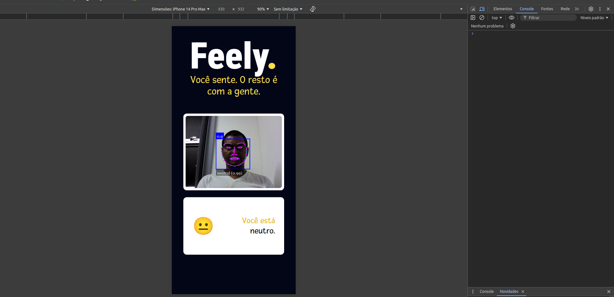

# 🎭 Mini Aplicativo de Leitura de Expressões Faciais
Este é um mini-aplicativo que realiza a leitura de expressões faciais utilizando **Vite**, **React**, **TailwindCSS** e **FaceAPI**.

<h1 align="center">
    
    
</h1>

## 🚀 Motivação e Objetivo

A motivação para este projeto foi explorar tecnologias com as quais eu tinha pouca experiência. Recriei um mini-projeto inspirado no canal **Codante**, utilizando a **FaceAPI** para capturar expressões faciais em tempo real. O objetivo é treinar o uso dessa API enquanto me aprofundo no React e no TailwindCSS.

## 🛠️ Requisitos

Antes de começar, certifique-se de ter o **Node.js** e o **npm** instalados em sua máquina. Caso contrário, você pode baixá-los [aqui](https://nodejs.org).

## 📦 Instalação

Para rodar o projeto localmente, siga os passos abaixo:

1. Clone o repositório para a sua máquina:

```bash
git clone https://github.com/Tiago-Silva/Facial-recognition.git
```

2. Instale as dependências necessárias:

```bash
npm install
```
ou, se preferir:

```bash
yarn install
```

3. Execute o projeto em modo de desenvolvimento:

```bash
yarn dev
```

## 🌟 Tecnologias Utilizadas

As principais tecnologias e ferramentas usadas no desenvolvimento deste projeto são:

<p align="center">
  <a href="https://skillicons.dev">
    
  </a>
</p>

## 🏅 Créditos

Este projeto foi baseado em um mini-projeto do pessoal incrível do canal **Codante**. Se quiser saber mais sobre eles e seus tutoriais, aqui estão os links:

- 🌐 Site oficial: [codante.io](https://codante.io/mini-projetos)
- 📹 Vídeo tutorial no YouTube: [Assista aqui](https://www.youtube.com/watch?v=-KFOYGrcpiA)

Foi através desses materiais que aprendi a utilizar a **FaceAPI** e apliquei o conhecimento para construir este projeto.

## 📝 Licença

Este projeto está licenciado sob a licença **MIT**. Para mais detalhes, consulte o arquivo [`LICENSE`](./LICENSE).
